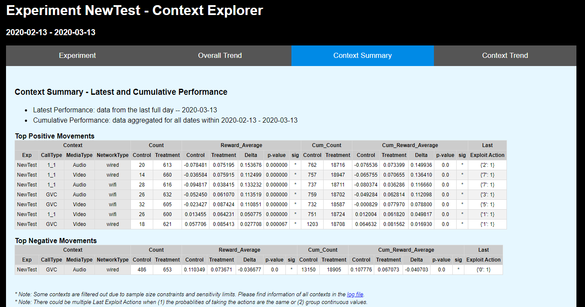

# Context Explorer
Context Explorer generates detailed context reports by reading DSJson logs. You can fild an example in the <i>sample_output</i> folder (Download the folder to view the HTML report). Here's a screenshot of the report:

## What is Context Explorer?
For contextual bandit problems, the model performance and impact may vary on different contexts. For some experiments, it is critical to understand how the model works for different contexts. 
Context Explorer tackles this problem in an A/B test fashion. The control group always takes the default action; the treatment group always applies the policy that learned by model. We then compare the performance of the two groups by context to help evaluate how the policy works.

The output is a single HTML file with 4 tabs:
* **Experiment Summary**: Experiment name and time range
* **Overall Trend**: Overall trend of counts, rewards and cumulative rewards
* **Context Summary**: Top sensitive contexts and their counts, rewards, exploit action
* **Context Trend**: Tope sensitive contexts and their trend of counts, rewards and cumulative rewards

In the report, some contexts may be excluded due to ample size constraints and sensitivity limits. You can find information of all contexts in an xlsx log file along with the report. A linked is provided at the bottom of the _Context Summary_ tab.

## Who can use Context Explorer? How?
In general, there are two use cases when you already have some logs from an experiment:
* Where there is no proper control group:
    * Step 1.   Prepare a <i>config_file.json</i> (details later). Specify a <i>"default_action_index"</i> in the config file. It will be used as control group
    * Step 2.   Generate the Context Explorer report by `python run_context_explorer.py "PATH/TO/config_file.json"`
* When there is a proper control group
    * Step 1.   Prepare a <i>config_file.json</i> (details later). Specify a <i>"control_identifier"</i> in the config file. 
    * Step 2.   Generate the Context Explorer report by `python run_context_explorer.py "PATH/TO/config_file.json"`
    
If you do not have an existing experiment but want to play with the Context Explorer, we provide a simulate data generator in this repo. Follow the steps below to generate simulated data and use Context Explorer:
* Step 1.   Generate a simulated dataset and logs by following instructions in the <i>Simulated_Data_Generator</i> folder
* Step 2.   Prepare a config file
* Step 3.   Generate the Context Explorer report by `python run_context_explorer.py "PATH/TO/config_file.json"`
        
        
## Context Explorer config file
The config file controls how you analyze your logs. Here is an example of the config file:

    {
        "exps": {
            "NewTest": {
                "start_date": "2020-02-12", 
                "end_date": "2020-03-02",
                "context_feature_namespace": ["Features"],
                "action_label_key": ["id"],
                "default_action_index": 0,
                "control_identifier": {
                    "_group": "control"
                },
                "data_folder": "E:\\data\\20190729_context_explorer\\simulated_data\\logs"
            }
        },
        "output_folder": "\\\\avdsp-share\\InputFiles\\p_learning\\Monitoring",
        "show_top_sensitive_contexts": 20,
        "min_daily_sample": 20
    }

* **exps** [dict]:
    * **exp_name** [key]
        * **start_date** [str]: _(optional)_ The earliest date to be considered for the analysis. Default the earliest date in the dataset
        * **end_date** [str]: _(optional)_ The last date to be considered for the analysis. Default the latest date in the dataset
        * **context_feature_namespace** [list]: Can be a list of string (eg: ["Features"]) or a list of list (eg: [["FromUrl", "dayOfWeek"], ["FromUrl", "networkType"]]) 
        * **action_label_key** [list]: The key within “_multi” in the DSJson logs. Its values will be served as action labels
        * **default_action_index** [int]: _(optional)_ The action that will be treated as control group. Default 0
        * **control_identifier** [dict]: _(optional)_ Key-value pairs from the DSJson logs that can identify the control group
        * **data_folder** [str]: The path where the target DSJson logs are located
* **output_folder** [str]: The path where the reports will be exported to
* **show_top_sensitive_contexts** [int]: _(optional)_ Only show the most sensitive contexts in the context analysis. Default 20
* **min_daily_sample** [int]: _(optional)_ Only show contexts with an average daily count that is at least min_daily_sample for both control and treatment group. Default 200

